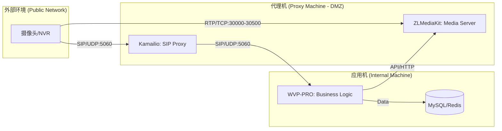
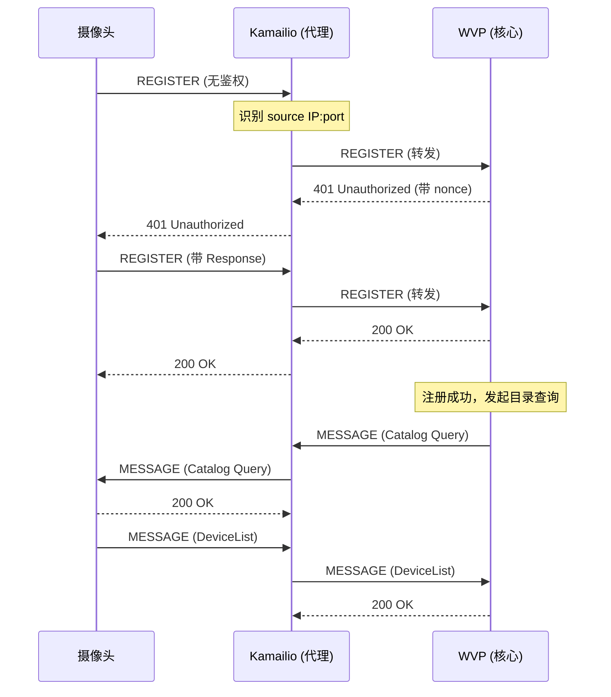
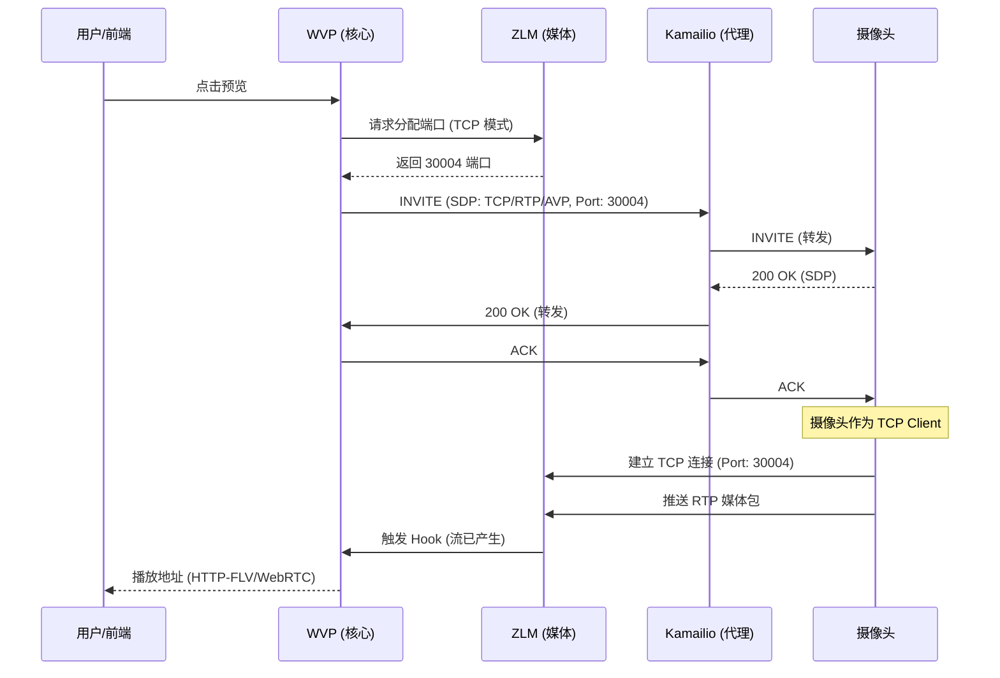

## 1. 业务背景与挑战

在大型安防项目中，核心业务平台（WVP）通常部署在企业内网的安全区域。而摄像头分布在公网各处，无法直接访问内网。为了实现接入，我们采用了**“内网业务 + 代理机边缘”**的架构。

### 核心挑战
1. **NAT 穿越**: 摄像头通常在私网内，需要 SIP 代理（Kamailio）识别其实际公网 IP 和端口。
2. **安全隔离**: WVP 不暴露在公网，通过 Kamailio 进行信令中转。
3. **网络抖动**: 公网环境下 UDP 丢包严重，需强制使用 **RTP Over TCP** 模式。
4. **端口映射**: 代理机需开启 5060 (UDP) 及大量的媒体端口（TCP）。

---

## 2. 详细架构方案

### 2.1 网络拓扑图


### 2.2 协议约定
- **信令**: 全程使用 **UDP**，由 Kamailio 处理 `rport` 修复。
- **媒体**: 强制 **TCP 被动模式**（摄像头作为 TCP 客户端，主动连接 ZLM 的监听端口）。

---

## 3. 核心信令流程图

### 3.1 注册与目录查询
这是设备接入的第一步，涉及鉴权与资源同步。



### 3.2 TCP 点播流程 (INVITE)
这是获取视频流的关键步骤，重点在于 SDP 协商中的 TCP 标识。



---

## 4. 核心组件深度配置

### 4.1 WVP 主要业务逻辑说明
WVP 不仅仅是一个 SIP 栈，它承担了复杂的业务编排：
- **流状态管理**: 通过 Redis 维护流的生存周期，超时未收到 ZLM 的 Hook 则自动释放端口。
- **TCP/UDP 转换**: WVP 必须在发送 `INVITE` 时，在 SDP 的 `m` 字段设置为 `TCP/RTP/AVP` 或 `TCP/RTP/SAVP`。
- **级联管理**: 支持作为下级平台向上级（如海康、大华平台）进行级联。

### 4.2 Kamailio 详细配置 (kamailio.cfg)
Kamailio 的核心任务是“欺骗”双方，让它们认为自己在直连。

```c
/* 核心：宣告公网 IP，否则 SDP 中的 IP 会是内网 IP */
listen=udp:172.16.0.10:5060 advertise 1.2.3.4:5060

/* 处理注册逻辑 */
route[REGISTRAR] {
    if (!is_method("REGISTER")) return;

    # 1. 记录客户端的真实公网 IP/Port
    force_rport(); 
    
    # 2. 如果来自内网 WVP，则转发给外网摄像头
    if (src_ip == "172.16.0.20") {
        $du = $ru; # 路由到 Contact 中的地址
    } else {
        # 3. 如果来自外网摄像头，转发给内网 WVP
        $du = "sip:172.16.0.20:5060";
    }
    t_relay();
}

/* 修复 Contact 头 */
onreply_route {
    if (is_method("INVITE") && status=="200") {
        fix_nated_contact();
    }
}
```

### 4.3 ZLMediaKit (ZLM) 配置 (config.ini)
ZLM 需要配置为被动模式接收 TCP 流。

```ini
[rtp]
# 端口映射必须覆盖此范围
port_range=30000-30500
# 开启 RTP Over TCP 接收
rtp_proxy_tcp=1
# 等待 TCP 连接超时时间 (秒)
timeoutSec=15

[rtp_proxy]
# 是否开启媒体代理
port=10000
```

**常用 ZLM 管理命令**:
- **查看流质量**: `curl http://zlm:80/index/api/getRtpInfo?secret=xxx&stream_id=xxx` (可查看丢包率、帧率)。
- **查看 TCP 连接数**: `netstat -anp | grep 30000 | wc -l`。

---

## 5. 运维与故障排查

### 5.1 抓包分析
- **信令抓包**: `tcpdump -i any port 5060 -X -s0`
    - 检查 `REGISTER` 是否包含 `rport`。
    - 检查 `INVITE` 的 SDP 中 `m=video 30004 TCP/RTP/AVP`。
- **媒体抓包**: `tcpdump -i any portrange 30000-30500`
    - 检查 TCP 三次握手是否成功。

### 5.2 常见问题
- **点播 488**: 通常是 SDP 协商失败，检查摄像头是否支持 TCP 模式。
- **注册频繁掉线**: 检查 Kamailio 的 `location` 过期时间是否短于摄像头的注册周期。
- **无流**: 检查代理机防火墙是否开放了 TCP 30000-30500。

---

> **总结**: 本架构通过 Kamailio 解决了信令层的 NAT 问题，通过 ZLM 的 TCP 模式解决了媒体层的网络质量问题，是目前最稳健的 GB28181 接入方案。
